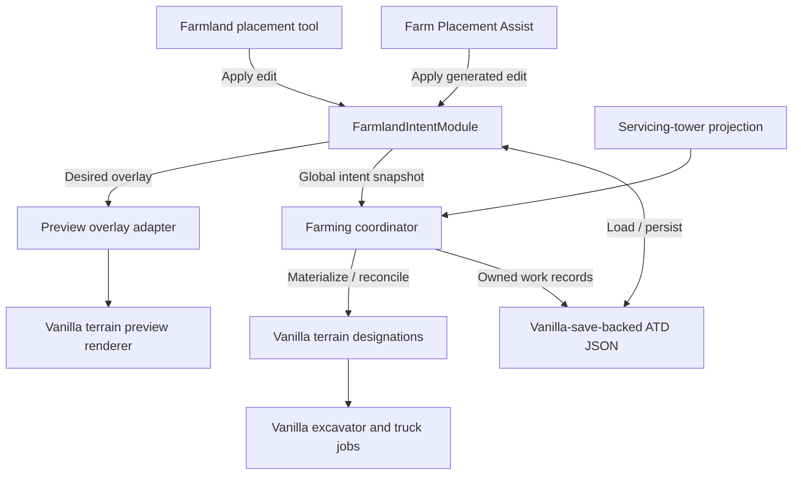

# Farmland Intent Designations

Status: conceptual design for later refinement and grilling. This is not an
implementation plan or a settled specification.

## Decision summary

Replace the use of vanilla leveling designations as the player's farmland
preparation intent with an ATD-owned **farmland intent**.

The player paints flat farmland intent through a dedicated terrain tool. ATD
persists that intent in its existing vanilla-save-backed mod JSON cache and
renders it as a distinct terrain overlay. The farming subprocess continues to
materialize ordinary vanilla mining, dumping, and leveling designations to make
vehicles perform the work.

Farmland intent and materialized vanilla terrain work are separate concepts:

- farmland intent says what finished ground the player wants;
- vanilla designations say what work is currently available to vehicles;
- an ATD ownership ledger says which vanilla work ATD may later update or
  remove.

Like a fulfilled vanilla terrain designation, farmland intent is a standing
desired state rather than a one-shot job. It remains after fulfillment until
the player removes it or successful farm placement consumes it.

The presence of farmland intent replaces the tower farming toggle as the
feature-enabling signal. The toggle is removed rather than redesigned.
Leveling designations return to their normal vanilla meaning.

## Motivation

Farming automation originally used flat leveling designations as a proxy for
farmland intent because ATD had no mod-specific state in the vanilla save. The
leveling designation provided durable target geometry and allowed the farming
workflow to reconstruct itself after load.

ATD can now persist mod-owned JSON through vanilla `ModJsonConfig`. The proxy
therefore has more costs than benefits:

- it takes ordinary leveling designations away from their normal use;
- it requires a tower-level farming automation toggle to disambiguate intent;
- temporary farming work has to replace or hide the same designation that also
  represents the ultimate target;
- the save hook must restore original leveling designations before every save
  so the next load can reconstruct the workflow;
- player intent and vehicle work are coupled even though they have different
  lifetimes and ownership rules.

Persisting farmland intent directly removes the reason for that coupling.

## Goals

- Give farmland preparation its own player-facing terrain designation mode.
- Preserve a visible representation of the requested finished farmland while
  temporary vanilla work changes underneath it.
- Stop interpreting ordinary leveling designations as farmland intent.
- Remove the farming enable/disable toggle as the normal activation mechanism.
- Preserve ATD's ability to be removed from a save.
- Permit best-effort recovery if ATD is reinstalled after an exceptional period
  of removal, without treating temporary removal as a normal workflow.
- Reuse the established farming analysis, preparation, filling, accessway, dump
  rule, and vehicle behavior wherever their semantics remain valid.
- Concentrate placement, persistence, rendering arbitration, ownership, and
  reconciliation behind one small module interface.

## Non-goals for the first implementation

- Sloped intent, ramps, corner shapes, or saddle geometry in the first
  implementation. This is an evolvable limitation, not a permanent domain
  invariant.
- Arbitrary polygons or freehand sub-tile painting.
- Making removal of ATD observationally equivalent to ATD never having run.
- Undoing all vanilla terrain work, tower settings, or vehicle state when ATD
  is removed.
- Persisting live `FarmingOriginPhase` objects or Unity/controller objects.
- A custom standalone terrain shader or renderer unless the vanilla preview
  renderer proves visually unsuitable.
- Global farmland preparation outside the area of a suitable tower.
- A generalized cultivation or terrain-suitability intent. This design remains
  specifically about farmland.

## Domain model

### Farmland intent

A durable player request for one flat 4x4 terrain-designation origin to finish
at a target height with farmable surface material.

Farmland intent is not a vanilla `TerrainDesignation`. It does not directly
create excavator or truck jobs.

### Intent origin

The 4x4-aligned `Tile2i` origin identifying one farmland intent cell. One origin
may have at most one farmland intent.

### Materialized farmland work

An ordinary vanilla mining, dumping, or leveling designation created or adopted
by ATD to advance farmland intent. Preparation shoulders, rim alignment, and
materialized accessway designations are also materialized work.

Materialized work is safe for vanilla to serialize because it references only
vanilla protos. It is globally ATD-owned rather than owned by any servicing
tower, and loss of tower coverage does not revoke that ownership.

### Owned work record

An ATD cache record containing enough information to prove that a particular
vanilla designation is still the work ATD created or adopted. At minimum this
includes its origin, role, proto ID, and exact `DesignationData`.

The persisted ledger covers every materialized farmland-work role: primary
preparation and filling work, preparation shoulders, rim alignment,
preparation and filling accessways, and farmland-specific debris cleanup.
Off-origin work must retain an association with the intent or access obligation
that justifies it, including shared associations where one designation supports
more than one intent origin.

Ownership is permission to mutate work, not proof that the designation still
exists. Ownership must be revalidated against the world before every destructive
change and after load.

Ownership is structural rather than historical. When the live origin, vanilla
proto, and complete `DesignationData` exactly match the owned-work record, ATD
may adopt the designation without proving that it is the same historical object
or that the player did not recreate an identical designation while ATD was
absent.

Fulfillment does not end ownership. A matching fulfilled designation remains in
the ledger for the lifetime of its associated standing intent, allowing later
cancellation, load reconciliation, and renewed work after disturbance.
Ownership ends when the intent is consumed or cancelled, the designation
disappears, or its structure no longer matches.

### Servicing tower

A capable area-managing tower whose area contains a farmland intent origin's
center tile, whose vehicles may service the corresponding materialized vanilla
work, and whose dumpable-product rules ATD can read and change. The center-tile
rule matches vanilla terrain-designation management. Intent is globally owned
rather than tower-owned, and several towers may service the same origin.

### Unmanaged farmland intent

Farmland intent whose center tile is not covered by a suitable servicing tower.
It remains valid and visible but produces no materialized work until tower
coverage becomes available.

### Farmland preparation cohort

The farmland intent and servicing towers transitively connected through shared
intent origins. All preparation in the cohort must complete before any of it
enters filling. Incidental geometric overlap between tower areas creates no
relationship when they share no farmland intent origin.

### Render-only farmland proto

A mod-owned `TerrainDesignationProto` used only as a color/shape argument to
the vanilla preview renderer. It must never enter `TerrainDesignationsManager`,
an input command, or any other vanilla save-visible object graph.

### Graceful degradation

The removal guarantee that a save remains loadable and playable without ATD.
It does not guarantee uninterrupted automation or automatic restoration of all
player and vanilla state modified while ATD was present.

## Proposed module and seam

`FarmlandIntentModule` should be a deep module whose external seam sits between
intent producers, the farming subprocess, and the implementation knowledge
needed to make intent durable and visible.

An illustrative interface is:

```csharp
FarmlandEditResult Apply(FarmlandEdit edit);
FarmlandIntentSnapshot SnapshotAll();
```

`Apply` serves the player tool, Farm Placement Assist, future construction
assistance, and debug commands. A mutation is either a set/replace batch or a
remove batch.

A committed farm-placement attempt is itself an explicit intent producer when
terrain preparation is the only blocker. Farm Placement Assist persists the
pending farm placement, applies footprint farmland intent through the same
interface, and replays the placement when that intent is fulfilled. This is
valid without current tower coverage; the generated intent is unmanaged until
a suitable servicing tower becomes available. If the player explicitly removes
any farmland intent required by that pending placement, ATD cancels the pending
placement as part of the same operation. It must not recreate the removed
intent or continue trying to place the farm. Pending farm placements may
temporarily overlap while terrain work is outstanding. The first placement to
succeed consumes the farmland intent under its footprint and cancels every
other pending placement that requires any consumed origin.

If replay later fails because a building, occupancy change, or other new non-
terrain condition makes the placement invalid, ATD cancels that pending
placement and raises one muted transient warning. It leaves the farmland intent
in place because the intent may predate the placement or remain useful. The
player can cancel that intent explicitly. The warning follows the standard
purge-before-save notification rule.

Repainting a required intent origin to the same target height is idempotent.
Repainting it to a different target height cancels the linked pending farm
placement while retaining the newly painted intent. ATD does not silently move
the committed farm transform or reinterpret a partially changed footprint.

`SnapshotAll` is the authoritative immutable query for rendering, diagnostics,
migration, persistence, and farming execution. The farming coordinator combines
it with a current intent-to-servicing-towers projection and constructs cohorts
from the resulting global graph. Tower-scoped projections may exist as
convenience diagnostics, but they do not drive execution, grant ownership, or
partition global intent.

`FarmlandIntentModule` owns only durable desired state: intent editing,
persistence, visibility, and immutable queries. It does not own farming phases
or materialized-work records. The farming-preparation subsystem owns its work
roles, ownership ledger, phase reconstruction, and reconciliation because
those are execution details. An application-level coordinator makes compound
operations such as intent cancellation logically atomic across intent removal,
owned-work cleanup, and pending-placement cancellation. Future Construction
Assist callers can therefore use farmland intent without depending on farming
shoulders, accessways, or the farming phase machine.

The implementation hides:

- input/controller state;
- 4x4 snapping and flat rectangle construction;
- target-height selection and height bias;
- persistence schema and migration;
- tower discovery and servicing relationships;
- preview-layer arbitration and reconstruction;
- owned-work validation and reconciliation;
- phase-to-display-state mapping;
- save/load ordering;
- malformed cache handling and diagnostics.

This interface is intentionally about intent. The farming subprocess should
continue to decide which preparation or filling work is required rather than
turning the intent module into a second farming state machine.

## Conceptual data flow



## Player interaction

The first version should provide a Farmland item beside the vanilla mining,
dumping, and leveling tools.

Recommended behavior:

1. Hover previews one flat 4x4 farmland cell at the target height inferred by
   the same snapped surface rule as vanilla leveling.
2. The standard terrain elevation controls raise or lower that target.
3. Beginning a click-drag locks the adjusted anchor height; every origin in the
   rectangular paint receives that same flat target height.
4. The standard clear-designation action removes farmland intent while this
   tool is active and cancels ATD-owned work justified only by that intent. It
   does not remove unrelated or player-modified vanilla designations.
5. Repainting an existing origin atomically replaces its target height with the
   newly locked drag height.
6. Intent outside a suitable tower remains visible as unmanaged farmland
   intent and produces no work.
7. The normal terrain-designation overlay controls when intent is visible.

A painted rectangle is only one editing gesture. It creates independent intent
origins and has no persisted batch, tower, cohort, or execution identity. One
drag may cross several preparation cohorts and unmanaged space; each origin is
classified from current servicing relationships after the edit is applied.

Existing vanilla work does not prevent painting intent. If the live
designation at an origin exactly matches the materialized role ATD currently
needs, ATD may adopt it and persist a structural ownership record. If it does
not match, ATD leaves it untouched and the intent remains blocked until that
designation disappears or becomes compatible. Declarative placement therefore
succeeds without granting permission to overwrite unrelated player work.

While any unmanaged farmland intent exists, ATD should show one continuous
warning notification with player-facing text equivalent to **"Farmland
preparation designations outside mine tower area."** This deliberately mirrors
vanilla's mining-designations-outside-tower warning. Because the notification
uses an ATD-owned proto, it must be muted, purged before serialization, and
rebuilt from current unmanaged intent after save/load.

Flat-only placement is deliberate for the first implementation. The immediate
finished product is a flat farm pad, and excluding vanilla ramp mode
substantially reduces the placement interface and invalid-state surface. It is
not a permanent domain invariant: a future generalization may prepare uneven or
sloped ground for forestry by preserving useful geometry while adding a soil
surface layer. That future desired-state model remains unspecified.

The current module should nevertheless remain farmland-specific. The more
probable expansion is broader Construction Assist, in which farmland
preparation is one prerequisite workflow alongside preparation for structures
that do not require farmable ground. Versioning should avoid blocking future
change, but the current interface must not introduce speculative cultivation or
forestry abstractions.

## Tower association

Farmland intent is globally owned and does not persist a tower ID as its
identity. This matches vanilla designations: the player marks terrain, and
tower coverage determines which vehicles can work it.

At runtime, ATD resolves every eligible area-managing tower whose area contains
an intent origin's center tile, mirroring vanilla's terrain-designation
management rule. All such towers are servicing towers. Several towers may
therefore service the same materialized designation; ATD does not elect an
intent owner, coordinator, or primary tower.

Eligibility is capability-based rather than restricted to the concrete vanilla
`MineTower` type. A servicing tower must support both halves of the workflow:
its job system can dispatch excavators and supporting trucks to excavation or
leveling work, and its trucks can service dumping work while ATD reads and
changes its dumpable-product rules. Having no suitable vehicles assigned at a
particular moment is an operationally blocked state, not loss of intrinsic
eligibility.

Vanilla `MineTower` and compatible subclasses use the built-in adapter. Any
other `IAreaManagingTower` must explicitly register a servicing adapter that
attests both excavation and filling capability and exposes the required
vehicle/job and dump-rule operations. Reflection over a `DumpableProducts`
member alone is not sufficient evidence. Merely implementing
`IAreaManagingTower` is also insufficient.

Changing tower areas recomputes the servicing relationship. An origin with no
suitable servicing tower becomes unmanaged farmland intent. The warning appears
when the first unmanaged origin exists and clears when none remain.

Tower geometry overlapping in an empty corner has no farming significance.
Servicing relationships join a farmland preparation cohort only through actual
shared intent origins. A chain of shared origins may join several towers and
their serviced intent transitively.

When filling restricts dumpable products, ATD must apply the required rule to
every tower that can service the affected filling designation. Those changes
may also affect the player's unrelated dumping work inside the same tower. That
is an accepted consequence of expressing farming through ordinary vanilla
tower work.

If all servicing coverage is lost, already-materialized work remains in the
world together with its owned-work records. It may resume if coverage returns.
Unmanaged dumping work may instead be serviced under vanilla/global dumping
rules and receive non-soil material. The unmanaged warning is the only
first-version mitigation; correcting or preventing that outcome is the
player's responsibility.

The farming inspector can retain status, vehicle policy, access, and diagnostic
controls, but serviceable global intent becomes the ordinary trigger for
farming activity. The first version has no farmland-specific pause state. The
player may pause servicing towers operationally or cancel intent explicitly;
intent-level suspension is deferred until demonstrated player demand.

The former tower Farmland Preparation toggle is removed. Neither manual intent
placement nor Farm Placement Assist requires a per-tower enable flag.

## Integration with the farming subprocess

`CaptureCurrentFlatFarmingDesignations` currently discovers intent by scanning
the tower's managed leveling designations. It should instead consume the
tower's farmland intent snapshot.

Each captured `FarmingOriginSession` receives its original/target
`DesignationData` from persisted intent. Existing concepts remain distinct:

- `FarmingAnalysisState` is a fresh read-only terrain assessment;
- `FarmingOriginPhase` is runtime execution progress;
- farmland intent is the durable desired outcome;
- owned work records identify the vanilla implementation of current progress.

Preparation and filling remain tower-level gated phases. The existing logic for
preparation at `targetHeight - 1`, farmable filling at `targetHeight`, shoulders,
rim alignment, access obligations, dump rules, and vehicle clear-out remains
applicable unless later refinement finds behavior coupled specifically to the
old leveling proxy.

The initial policy remains **soil-conserving tower gating**. All preparation in
a farmland preparation cohort must complete before any origin in that cohort
enters filling. Preparation may itself require filling, and retaining every
servicing tower's ordinary dump rules allows that fill to use non-soil material.
This also avoids wasting soil on temporary preparation fill. A ready pad
therefore waits for distant preparation linked through the same servicing tower.
Players who want independent progress can split coverage across towers that do
not share farmland intent origins.

A future player policy may deliberately allow early soil filling, accepting
that preparation fill could consume soil and that non-soil fill may become
unavailable. That choice is deferred from the first implementation.

ATD may replace one structurally owned materialized role with another as the
workflow advances. It does not overwrite incompatible player work. Materialized
work never replaces the underlying intent because intent is stored separately,
although same-origin work may suppress its visualization as described below.

Explicitly removing intent is cancellation. ATD removes every still-
structurally-owned designation justified only by the removed intent. Shared
shoulders, accessways, or other support work remain while at least one surviving
intent still references them; they are removed when their final justification
disappears. A designation changed by the player no longer matches structural
ownership and is left untouched. Cancellation of any intent origin required by
a pending farm placement also cancels that placement; clearing the intent is
the player's simple and authoritative way to abandon the committed placement.

## Completion semantics

The intended behavior is:

- intent remains durable throughout preparation and filling and is visible
  whenever the normal overlay is active and no higher-priority same-origin
  preview or materialized designation suppresses it;
- a stably farmable origin becomes `Ready` while retaining the same intent
  color;
- Farm Placement Assist removes linked intent after the farm placement has
  successfully replayed;
- when pending farm placements overlap, the first successful placement wins;
  consuming its footprint intent cancels competing placements that require any
  of those origins;
- manually painted ready intent remains until the player clears it;
- ready, unoccupied intent automatically restarts preparation if the terrain
  later ceases to satisfy it;
- automation must not attempt terrain work underneath an existing farm or
  other incompatible static entity.

## Rendering design

The preferred first implementation reuses
`TerrainDesignationsRenderer.AddOrUpdatePreviewDesignation` with a render-only
farmland proto carrying one stable, unique farmland-intent color. Pending,
active, blocked, unmanaged, and ready states do not introduce additional
colors in the first version. The chosen color family is purple; the renderer
spike should tune the exact RGBA for legibility against terrain and vanilla
designation colors.

Farmland intent follows vanilla terrain-designation visibility: it is shown
when the normal terrain-designation overlay is active and hidden when that
overlay is inactive. Independent or always-on visibility is outside the first
version and would likely require a dedicated renderer.

This is feasible but the vanilla preview renderer is not a true multilayer
renderer:

- previews are keyed by one slot per 4x4 origin;
- a live vanilla placement preview can overwrite the farmland preview;
- removing that live preview can remove the only rendered entry;
- preview-only chunks may be discarded when the renderer deactivates;
- materialized vanilla work and the persistent preview may render at identical
  geometry and need visual quality testing.

Farmland intent is durable but not visually dominant. Any materialized vanilla
terrain designation at the same origin may suppress the farmland preview while
that work exists, including preparation work targeting a level below the final
farmland height. This is acceptable and avoids requiring two coincident meshes
to blend cleanly. The overlay adapter restores the intent visualization after
the materialized designation disappears. Suppression never removes or fulfills
the underlying intent.

ATD therefore needs an internal preview overlay adapter with logical priority:

1. active vanilla placement preview;
2. active farmland removal/edit highlight;
3. persistent farmland intent;
4. no preview.

When the active vanilla preview leaves an origin, the adapter restores the
farmland layer. Brief same-origin occlusion by the active vanilla preview is
acceptable. When the renderer activates, the adapter reconstructs all
desired farmland previews from the authoritative intent snapshot.

ATD already patches the vanilla preview methods for corner designation mode.
Those patches should be deepened into one shared preview arbiter instead of
creating an unrelated second interception path. The arbiter owns only preview-
slot priority and restoration; corner mode and farmland intent retain separate
tool state and domain behavior.

If in-game testing shows unacceptable flicker, blending, visibility lifetime,
or patch fragility, the same intent module interface should support replacing
the preview adapter with an ATD-owned renderer. Renderer choice must remain an
internal seam rather than leak into intent callers.

## Persistence model

The existing ATD world-state JSON should be extended with versioned farmland
intent and owned-work collections. Illustrative, not final, JSON:

```json
{
  "schemaVersion": 2,
  "farmlandIntents": [
    [120, 84, 7]
  ],
  "farmlandOwnedWork": [
    {
      "role": "Preparation",
      "proto": "LevelDesignator",
      "origin": [120, 84],
      "heights": [6, 6, 6, 6]
    }
  ]
}
```

The first-version intent needs only origin and target height because its
geometry is flat. Schema versioning must leave room for a future intent kind or
surface profile that can express uneven ground, but this design does not specify
that representation. Owned-work data is larger because conservative
reconciliation needs exact expected geometry. Compact representations and
realistic size tests should precede a final schema decision.

The current game code imposes no `ModJsonConfig` string limit when a parameter
does not declare `max_length`, and ATD's state parameters declare none. The
value is serialized through the normal string serializer, so practical memory,
save-size, and serialization-time costs—not a small fixed game cap—govern the
design. Use compact records and benchmark realistic large intent and owned-work
sets before freezing the schema.

Cache decoding uses record-level salvage. A malformed intent, pending farm
placement, or owned-work record is ignored without rejecting other valid
records or failing game load. ATD logs record-level diagnostics and raises one
muted transient warning that some farmland automation state could not be
restored. That mod-owned notification is rebuilt from runtime recovery state
and purged before every save under the normal notification-removability rule.

Runtime caches, live tower references, renderer entries, notification IDs,
coroutines, and pathfinding requests must not be serialized into this model.
Runtime farming phase is also not persisted, even as an authoritative hint.
After load it is reconstructed from intent, reconciled owned work, surviving
vanilla designations, and current terrain. Core terrain classification examines
the 16 cells of each 4x4 intent origin, so reconstruction is linear in the
number of intent origins rather than a whole-map scan. More expensive access
analysis may resume through its normal scheduled workflow.

## Save and removal contract

The removability contract is:

> Removing ATD must leave a vanilla-loadable, playable save. It does not have
> to restore the state that would have existed if ATD had never run, and it does
> not have to keep ATD's automation flowing without ATD.

Consequently, vanilla-owned state may remain in the save:

- mining, dumping, and leveling designations;
- preparation shoulders and rim alignment work;
- materialized accessway designations;
- tower dump rules changed for farmable filling;
- vanilla vehicle assignments or releases;
- partially completed terrain work;
- the inert ATD JSON cache.

These may produce transient or persistent gameplay consequences after removal.
That is acceptable because the player can load the save and correct vanilla
state manually.

The save hook should only protect against actual mod dependencies:

1. persist the latest intent and owned-work ledger;
2. purge ATD-owned notification instances;
3. verify by construction that no render-only farmland proto or other mod-owned
   runtime object has entered a vanilla save-visible graph;
4. allow vanilla to serialize its current state unchanged.

There should be no farming-wide post-save restoration cycle. Runtime-only
previews, requests, callbacks, and coroutines are not serialized and are rebuilt
or restarted as needed.

## Load and reconciliation

When ATD is present, load should reconcile cached intent and expected work with
the actual vanilla world.

For each owned-work record:

- **Exact match:** adopt the vanilla designation and retain ownership.
- **Missing designation:** drop the ownership record, reanalyse the associated
  intent, and materialize new work only if still required.
- **Different proto or geometry:** treat it as a player or vanilla change,
  relinquish ownership, and do not overwrite it automatically.
- **Missing intent:** relinquish ownership and leave matching vanilla work
  untouched. Without surviving player intent, ATD has no authority to continue
  or clean up that work.
- **Invalid or unknown vanilla proto:** ignore the record and log a diagnostic.

After ownership reconciliation, fresh terrain analysis determines the runtime
phase. No persisted phase may override current terrain and designation facts.

When ATD is absent, vanilla loads and continues with the saved designations,
tower dump rules, and vehicle state. When ATD is reinstalled, its JSON cache can
still be present; reconciliation must tolerate vanilla work having completed,
changed, or been removed during the absence.

This reconciliation is a best-effort recovery path, not a routine usage model.
Removability primarily protects players against sudden incompatibility or an
abandoned mod so they can continue the save without ATD.

## Ownership rules

ATD may mutate or remove a vanilla designation only when all of the following
remain true:

1. a current owned-work record exists for the origin;
2. the live designation proto matches the expected vanilla proto;
3. the live `DesignationData` matches the expected geometry;
4. the associated intent/workflow still authorizes the change.

Any mismatch revokes ownership before mutation. This compare-before-change
rule protects player edits and makes stale caches fail conservatively.

Ownership records for shoulders, rims, and accessways need an association with
the intent region or tower obligation that created them. The association must
be strong enough for cleanup and diagnostics without making runtime request
objects persistent.

## Migration from leveling-proxy saves

Migration must avoid interpreting every leveling designation in every existing
save as farmland.

The one-time migration is:

1. detect an older cache schema with farming automation enabled for a tower;
2. scan that tower's current flat leveling designations using the old capture
   rules;
3. convert those designations into farmland intent records;
4. retain the same vanilla leveling designations as materialized work and add
   matching ownership records where safe;
5. remove the old enable flag after successful persistence;
6. leave disabled towers and saves without prior farming state untouched.

This is consistent with the old feature contract: while farming automation was
enabled, eligible flat leveling designations in that tower already meant
farmland to ATD.

That evidence is intentionally sufficient despite its ambiguity: ordinary
leveling placed inside a legacy farming-enabled tower was already subject to
the old farming interpretation. If overlapping enabled towers manage the same
eligible origin and geometry, migration creates one global farmland-intent
record and one matching ownership record rather than tower-specific duplicates.

Running old-version sessions should normally have been restored to their
original leveling designations by the old save hook. Migration still needs
fixtures for interrupted saves, debug-created preparation work, and malformed
or partially missing cache data.

Migration is transactional. ATD builds and validates the complete deduplicated
candidate set, logs source-tower and resulting-origin counts, and advances the
schema/removes the legacy enable flags only after the new cache persists
successfully. Persistence failure leaves the legacy marker intact and retries
later; no partial migration is committed. There is no arbitrary maximum-origin
cutoff because a very large legacy farm may be legitimate.

## Failure and degradation behavior

- **Cache cannot be loaded:** do not infer global farmland intent from ordinary
  leveling designations except through an explicit known-schema migration.
- **Cache cannot be saved:** keep runtime intent, report that durability failed,
  and retry at the next safe opportunity; do not claim the edit is durable.
- **Renderer unavailable:** keep intent authoritative, retain existing vanilla
  work, pause creation or mutation of new materialized farmland work, report
  degraded visibility through a muted transient warning, and retry
  reconstruction. Resume automation after visualization is restored. This is
  a defensive response to renderer integration failure, such as changed game
  internals or repeated adapter exceptions; merely turning off the normal
  terrain-designation overlay does not pause automation.
- **No suitable tower:** retain unmanaged farmland intent without materializing
  work and maintain the transient outside-tower warning.
- **Tower destroyed or moved:** recompute the servicing relationship, retain
  globally owned materialized work, and let the intent become unmanaged when no
  servicing tower remains.
- **Player replaces owned work:** relinquish ownership and expose the conflict
  in status rather than fighting the player.
- **Intent painted over incompatible vanilla work:** retain the intent, leave
  the vanilla designation untouched, and keep the origin blocked until the
  conflict disappears or becomes structurally adoptable.
- **ATD removed:** accept the remaining vanilla state as graceful degradation.

## Rejected or deferred alternatives

### Continue using leveling designations

Rejected because persistence no longer requires the proxy and the design keeps
intent coupled to execution work.

### Register a saved farmland `TerrainDesignationProto`

Rejected because a live `TerrainDesignation` retains its proto. A saved
mod-owned proto reference would make the save fail to deserialize without ATD.
It would also occupy the manager's single designation slot at the same origin
needed by materialized vanilla work.

### Reuse the complete vanilla leveling controller through command interception

Deferred/rejected as the primary design. It offers maximum UI reuse but depends
on private controller state, deferred command identification, and custom removal
selection for objects that do not exist in `TerrainDesignationsManager`.

### Build a dedicated renderer immediately

Deferred until a focused preview-renderer spike proves it necessary. A custom
renderer offers true layering and independent visibility but creates much more
Unity, mesh, shader, lifecycle, and game-version-sensitive implementation.

## Prototype and verification gates

Before committing to the full refactor, a narrow spike should prove:

1. a render-only custom proto produces the intended unique color;
2. persistent intent previews can be reconstructed after renderer activation;
3. live vanilla previews temporarily win and farmland intent reliably returns;
4. same-origin materialized work, including work one level below the final
   target, can suppress intent cleanly and intent reliably returns afterwards;
5. painting and clearing can be implemented without mutating ordinary terrain
   designations;
6. a large realistic farm area does not make preview reconciliation or JSON
   persistence unacceptably expensive;
7. saving mid-preparation and mid-filling retains vanilla work unchanged;
8. load reconciliation adopts exact work and relinquishes modified work;
9. saves load without ATD while preparation and filling state remains;
10. reinstalling ATD reconciles after vanilla has progressed without it.

## Tentative implementation sequence

1. Run a throwaway render-only proto and preview-arbitration spike. Continue
   with vanilla preview reuse only if its visual, lifecycle, and save-safety
   gates pass; otherwise choose the dedicated-renderer fallback.
2. Introduce pure farmland intent and owned-work models with fixture tests.
3. Extend the versioned ATD JSON schema and implement old-save migration.
4. Implement servicing-tower projection and immutable snapshots.
5. Turn the successful spike into the shared production preview arbiter.
6. Implement the flat farmland placement/removal tool.
7. Change farming capture from leveling designations to intent snapshots.
8. Add conservative materialized-work ownership and load reconciliation.
9. Remove farming save-time designation restoration and post-save replay.
10. Integrate Farm Placement Assist with the same intent mutation interface.
11. Remove the tower farming toggle and update player UI/docs.

## Explicitly deferred extensions

- Broader Construction Assist may use farmland intent as one prerequisite
  through the same intent interface. Coordination with non-farmland structure
  preparation is outside this module and remains to be designed.
- A future player policy may allow soil filling before all preparation in a
  cohort completes. Whether that policy belongs globally, per servicing tower,
  or on intent is deliberately unspecified in the first version.
- Uneven or sloped soil-surface preparation for forestry remains a possible
  later generalization, not part of the farmland-specific first version.
